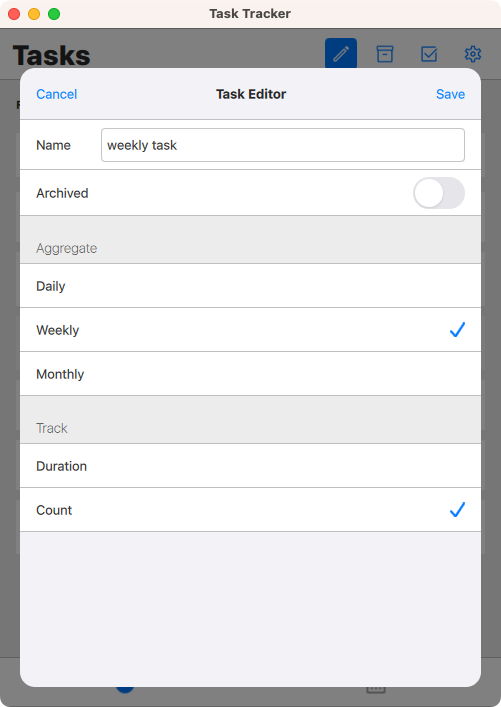

# Task Tracker (WIP)

Simple task tracker.

* the user can track the time spent on a task or how many times the task was done
* the app can show the aggregate (totals) the time spent or times done by:
  * day (the default)
  * week
  * month
* weekly aggregates depend on the week start (week start can be changed in the config dialog)

## Screenshots

